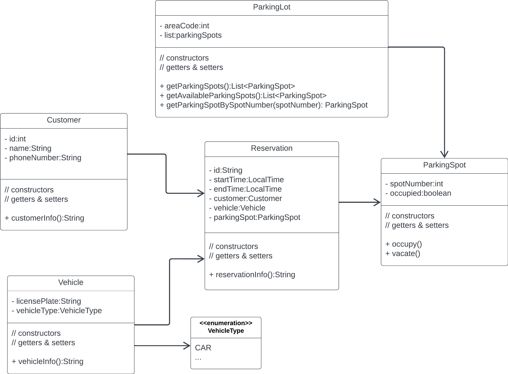

# Parking Rental App

## ParkingLot
- Represents a parking are that contains multiple parking spots
- **Attributes**
  - `areaCode: int` - the unique identifier for the parking lot
- **Associations**
  - To ParkingSpots
  
## ParkingSpot

## Customer

## Vehicle

## VehicleType

## Reservation

### Class Diagram

